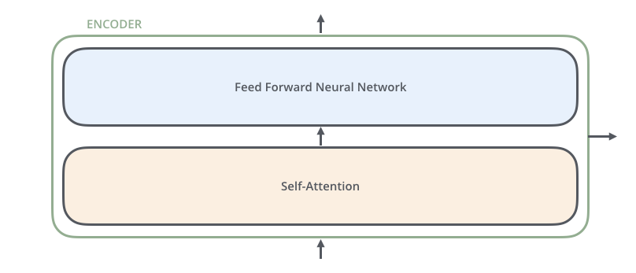
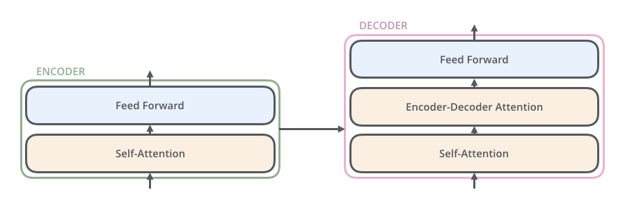
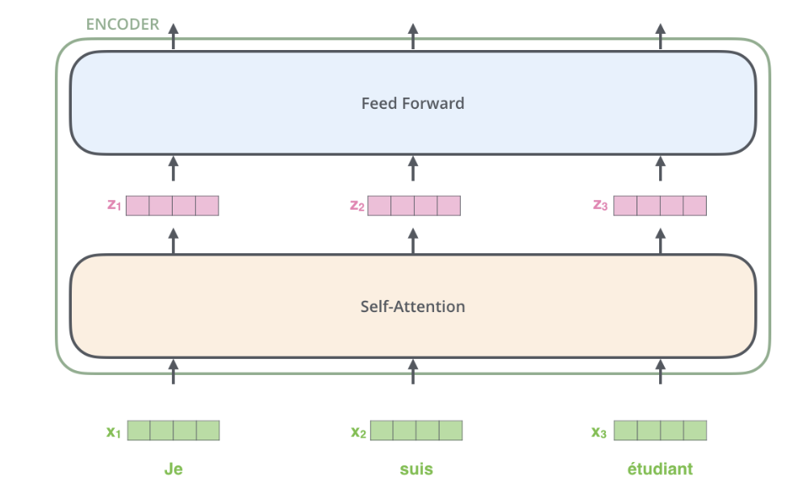
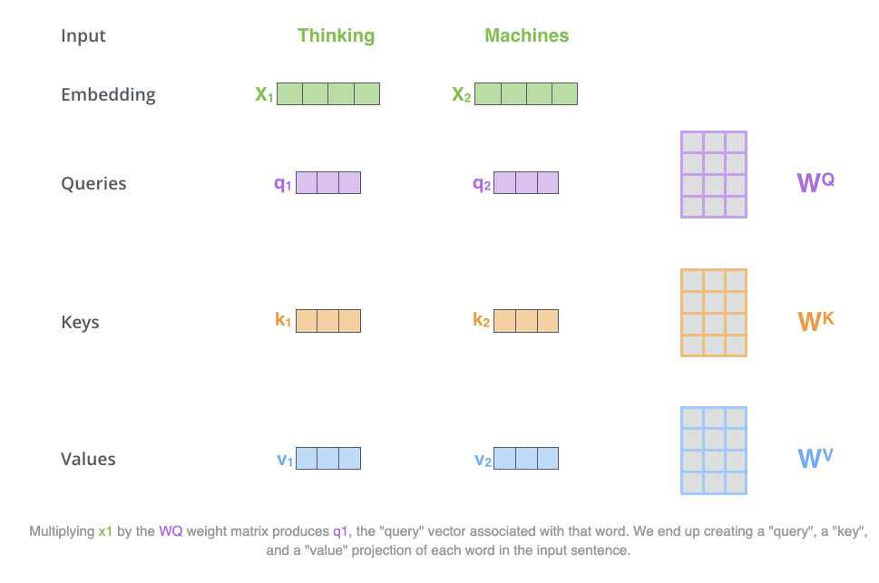
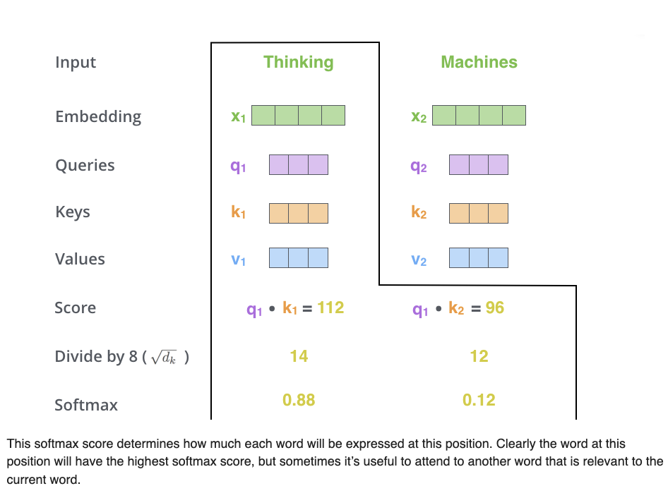

### Transformer A High-Level Look
 
                     
    
                       
The transformer block contain encoding component, a decoding component as depicted below

    
                     
The encoding component is a stack of encoders (the paper stacks six of them on top of each other as per official paper). The decoding component is a stack of decoders of the same number.

    
   
All Encoders are identical in structure .Each encoder in broken in two layers 1. Feed forward Neural Network 2. Attention layer

    
   
The input is given to the encoder self attention layer and output of self attention layer is fed to the feed forward neural network .The exact feed forward neural network is applied to each position(each word in sentence)

The Decoder has both the encoder layers but it has encoder-decoder attention layer in between . which helps the decoder to focus on relevent parts of the input sentence  

   

Each sentence as a input conveted in to vector for using word embedding algorithms and the given as list of vectors each of the size 512 inputs to the Attention layer of encoder .The size of this list is hyperparameter we can set – basically it would be the length of the longest sentence in our training dataset.

After embeding words in squence(vector) each of them flows through each of the two layers of the encoder.

One key property of the Transformer, which is that the word in each position flows through its own path in the encoder. There are dependencies between these paths in the self-attention layer. The feed-forward layer does not have those dependencies, however, and thus the various paths can be executed in parallel while flowing through the feed-forward layer.

As we’ve mentioned already, an encoder receives a list of vectors as input. It processes this list by passing these vectors into a ‘self-attention’ layer, then into a feed-forward neural network, then sends out the output upwards to the next encoder.

    
   
   
   
  # Self-Attention
  
 Say the following sentence is an input sentence we want to translate:

 ”The animal didn't cross the street because it was too tired”
  
What does “it” in this sentence refer to? Is it referring to the street or to the animal? It’s a simple question to a human, but not as simple to an algorithm.
When the model is processing the word “it”, self-attention allows it to associate “it” with “animal”.

As the model processes each word (each position in the input sequence), self attention allows it to look at other positions in the input sequence for clues that can help lead to a better encoding for this word.

The first step in calculating self-attention is to create three vectors from each of the encoder’s input vectors . So for each word, we create a 1.Query vector,2. a Key vector, 3. Value vector.
What are the “query”, “key”, and “value” vectors?
They’re abstractions that are useful for calculating and thinking about attention

How to create self attention

step-1:

The first step in calculating self-attention is to create three vectors from each of the encoder’s input vectors (in this case, the embedding of each word). So for each word, we create a Query vector, a Key vector, and a Value vector. These vectors are created by multiplying the embedding by three matrices that we trained during the training process.

Notice that these new vectors are smaller in dimension than the embedding vector. Their dimensionality is 64, while the embedding and encoder input/output vectors have dimensionality of 512. They don’t HAVE to be smaller, this is an architecture choice to make the computation of multiheaded attention (mostly) constant.

   

step-2:

The second step in calculating self-attention is to calculate a score. Say we’re calculating the self-attention for the first word in this example, “Thinking”. We need to score each word of the input sentence against this word. The score determines how much focus to place on other parts of the input sentence as we encode a word at a certain position.
The score is calculated by taking the dot product of the query vector with the key vector of the respective word we’re scoring. So if we’re processing the self-attention for the word in position #1, the first score would be the dot product of q1 and k1. The second score would be the dot product of q1 and k2.

step-3:

 The 3rd step is  to divide the scores by 8 (the square root of the dimension of the key vectors used in the paper – 64. This leads to having more stable gradients. There could be other possible values here, but this is the default)
 

step-4:

 Fourth step then pass the result through a softmax operation. Softmax normalizes the scores so they’re all positive and add up to 1.
 
   
