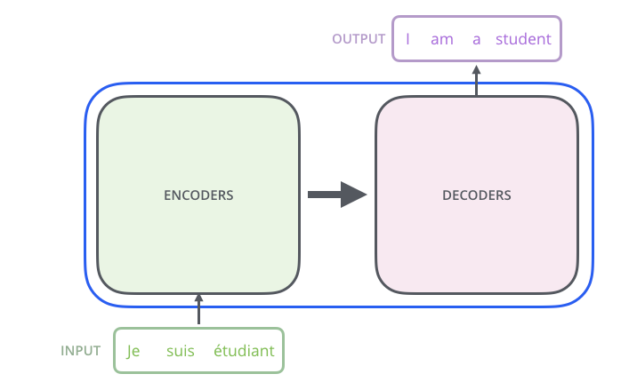
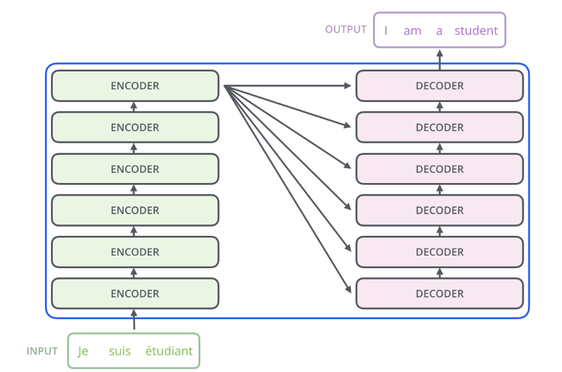

### Transformer A High-Level Look
 
                     
    
                       
The transformer block contain encoding component, a decoding component as depicted below

    
                     
The encoding component is a stack of encoders (the paper stacks six of them on top of each other as per official paper). The decoding component is a stack of decoders of the same number.

    
