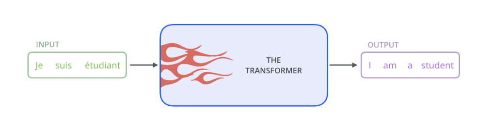

### Transformer A High-Level Look
 
                     
    
                       
The transformer block contain encoding component, a decoding component as depicted below

    
                     
The encoding component is a stack of encoders (the paper stacks six of them on top of each other as per official paper). The decoding component is a stack of decoders of the same number.

    
   
All Encoders are identical in structure .Each encoder in broken in two layers 1. Feed forward Neural Network 2. Attention layer

    
   
The input is given to the encoder self attention layer and output of self attention layer is fed to the feed forward neural network .The exact feed forward neural network is applied to each position(each word in sentence)

The Decoder has both the encoder layers but it has encoder-decoder attention layer in between . which helps the decoder to focus on relevent parts of the input sentence  

   

Each sentence as a input conveted in to vector for using word embedding algorithms and the given as list of vectors each of the size 512 inputs to the Attention layer of encoder .The size of this list is hyperparameter we can set – basically it would be the length of the longest sentence in our training dataset.
